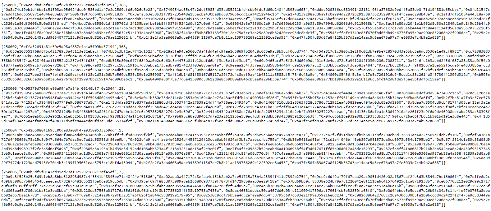
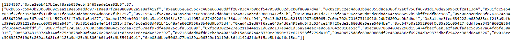
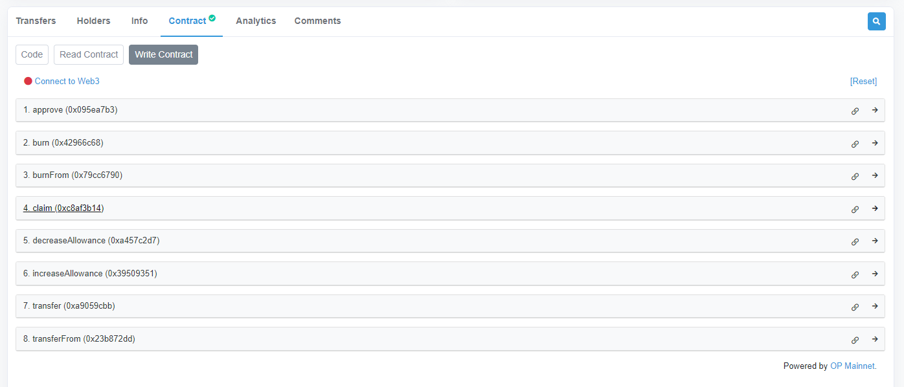
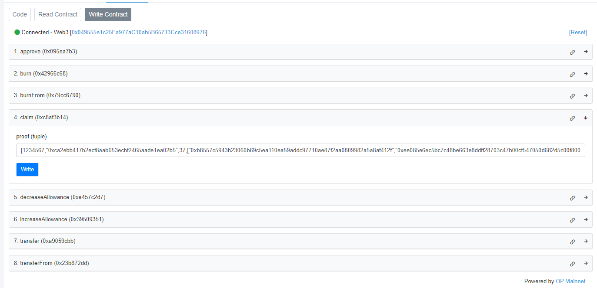

# Introduction  
Rebel DAO (REBEL) is an erc20 token and a merkle airdrop where early XEN minters with a rank from 1 to 3,200,000 can claim.  
The amount of REBEL you get is proportional to the mint term with a multiplier starting at 400%.
The multiplier goes down linearly to 80% as claims are made.
The tokens are on the Optimism Network.
The token contract address is 0xAc42B086555236547f61DeCB4307ACC440Bce7CC.

# How to Claim REBEL

1. Locate your crank in the proof file. There are 320 files in the proofs folder named proof000.txt to proof319.txt. Each file has a group of 10,000 entries. For example you own crank 1,234,567 open proof123.txt https://raw.githubusercontent.com/ph4n70mr1ddl3r/rebel/main/proofs/proof123.txt and locate the crank.

2. Copy the whole block of data.

3. Open https://optimistic.etherscan.io/token/0xAc42B086555236547f61DeCB4307ACC440Bce7CC#writeContract and connect your wallet by pressing "Connect to Web3".

4. Expand the claim function and put the claim data in the proof field. Then press Write to execute the transaction. Approve the transaction and wait for your REBEL tokens.

# Notes:  
You can use any account in Optimism to claim and pay for gas but the REBEL tokens will always go to the proper address in the proofXXX.txt file.  
It will cost about 0.00007 ETH to claim.  

## Telegram  
https://t.me/rebelsofxen

## Twitter
https://twitter.com/ph4n70mr1ddl3r

## Tally
https://www.tally.xyz/gov/rebel-dao
